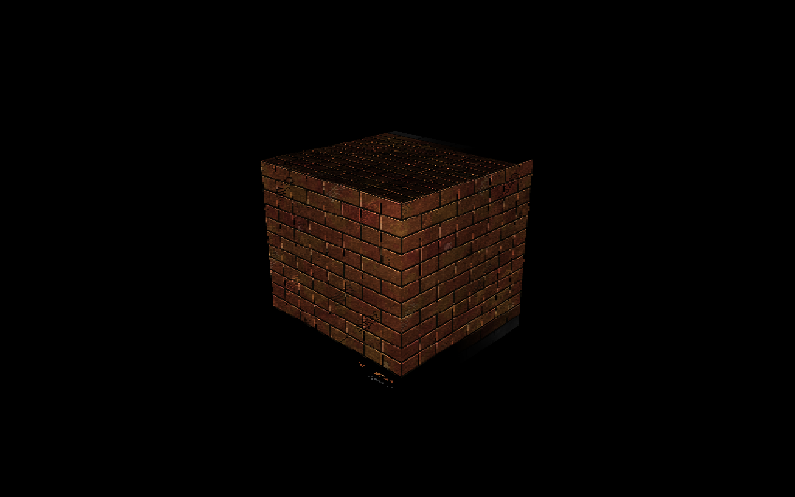

# Metal3DPlayground

This is my Apple Metal 3D rendering learning path. This code contains 3D cube, phong light model and normal mapping the texture.

###### This was created by Przemek Paciorek as Junior Software Developer trainee in MotionVFX.
